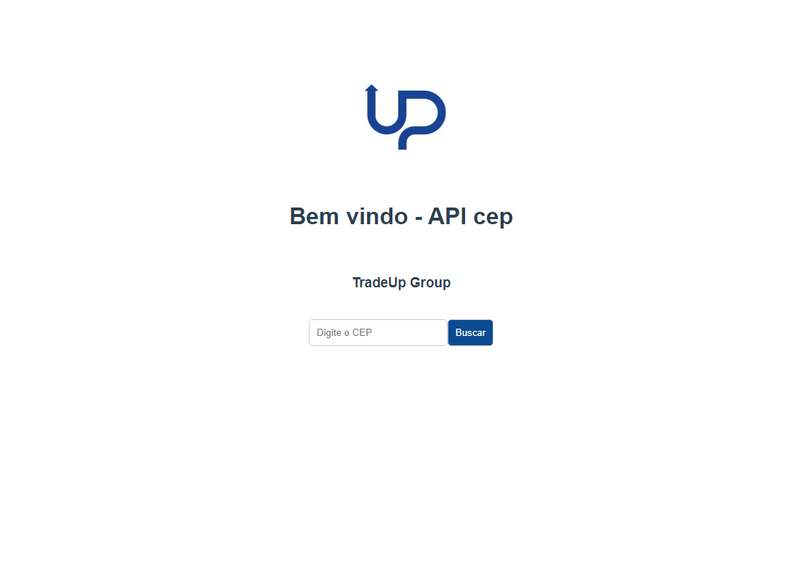

# Projeto: cep-frontend

## Clone the project

`git clone git@github.com:flavioanalistadesistema/cep-frontend.git`

## Project setup

```
npm install
```

### Compiles and hot-reloads for development

```
npm run serve
```

### Compiles and minifies for production

```
npm run build
```

### Lints and fixes files

```
npm run lint
```

<br>

# Links acesso

Produção: `Url: https://cep-frontend.vercel.app/`
<br>
Local: `http://localhost:8080/`

### Imagem do projeto finalizado


